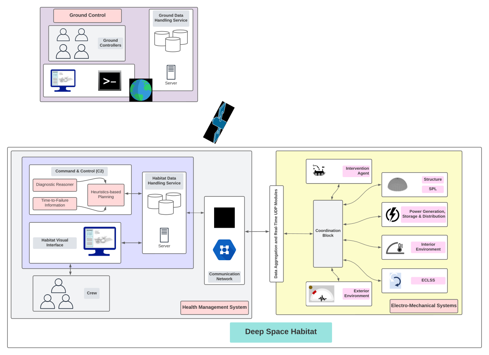
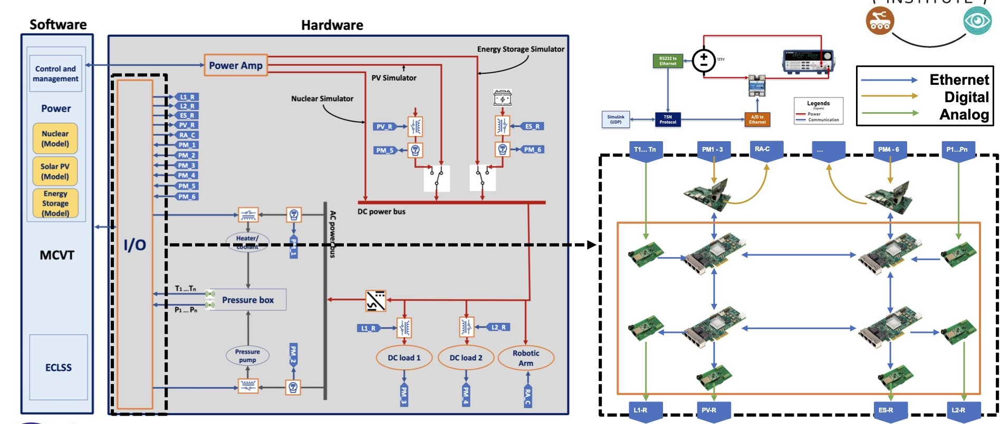
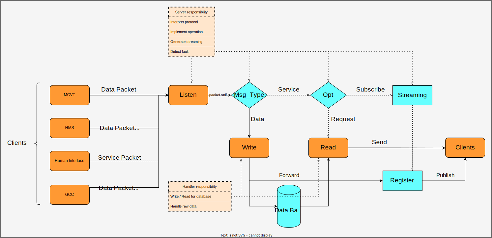
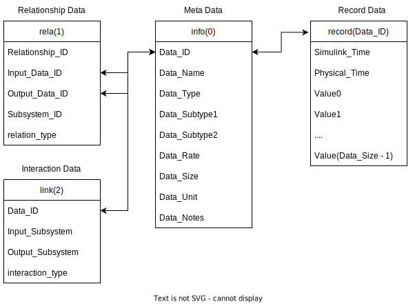
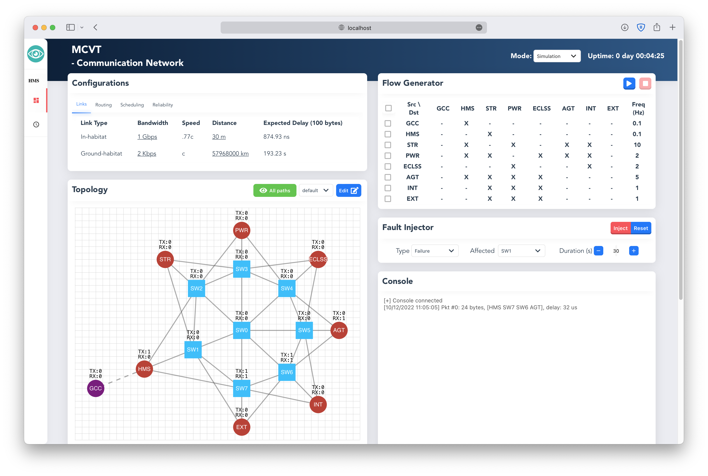
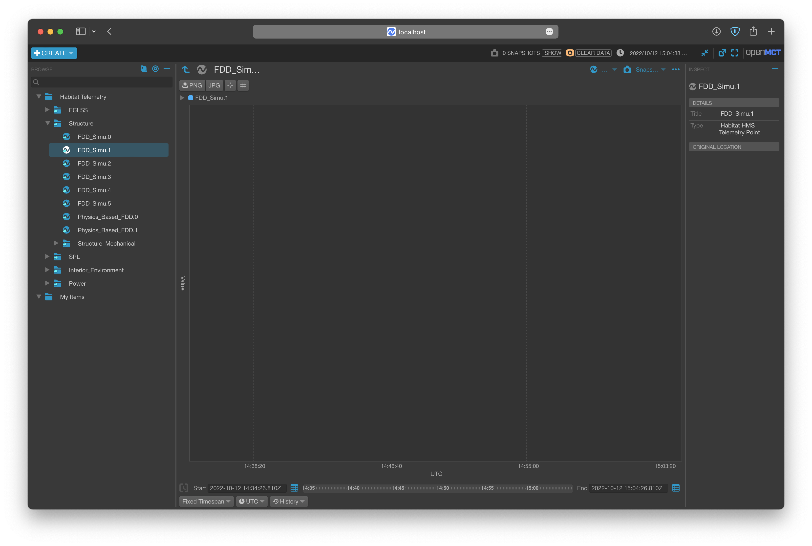
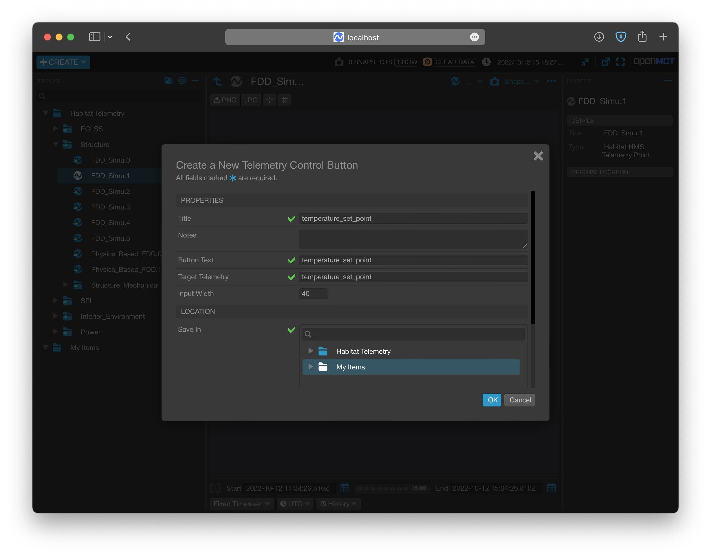
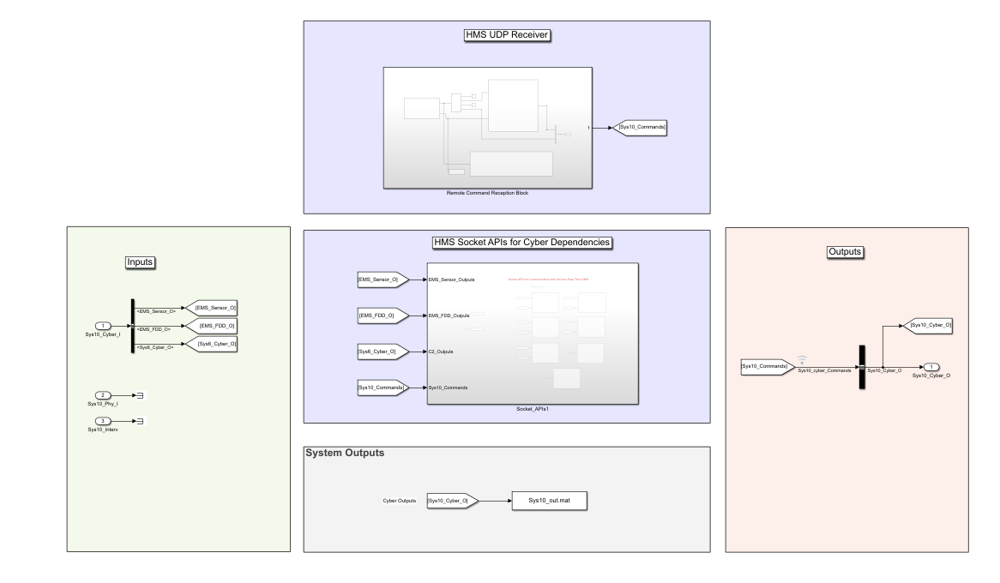
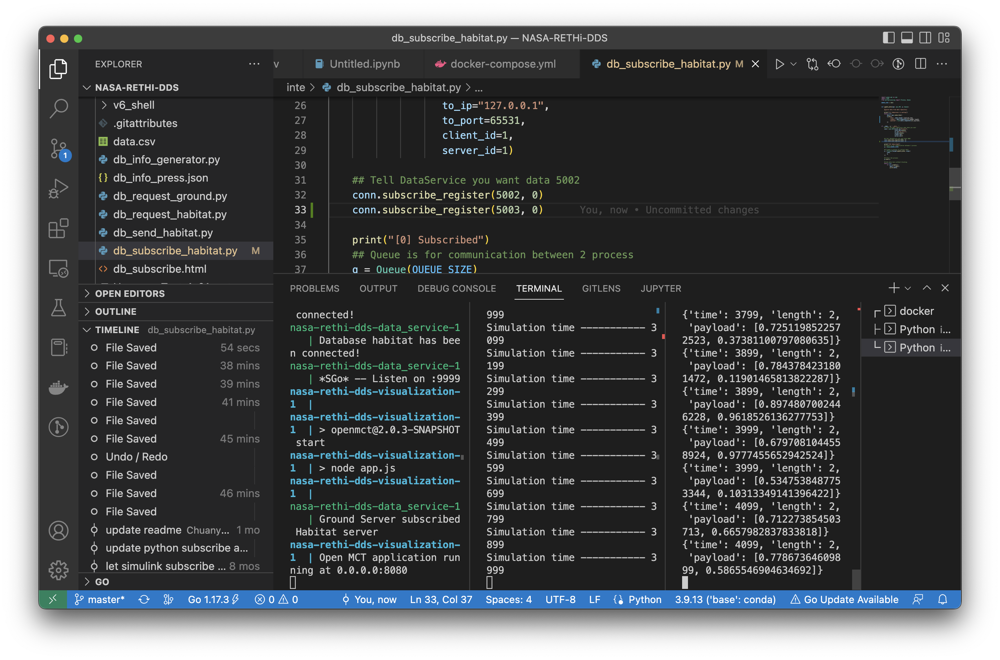

# Data Service for NASA RETHi Project

## 1. Project introduction
Please see https://www.purdue.edu/rethi

## 2. Current design

### 2.1 DS - Overall architecture of MCVT


### 2.2 DS - Overall architecture of CPT


### 2.2 DS - Data flow within DRDS


### 2.3 DS - Database schema



### 2.4 DS - Program architecture


## 3. Service Protocol
- **For Python, please refer to  [demo.py](utils/c2_usecase.py) and [api.py](utils/pyapi/api.py).**
- **For GoLang, please refer to [main.go](main.go).**
- **For JavaScript, please refer to [demo.html](utils/db_subscribe.html)**
- **For Simulink, please refer to [MCVT_v6_shell.slx](utils/simapi/power_switch.slx)**
- **For other Language, please implement by following standards:**


### 3.1 Packet Format

Data packet is the basic form to send data and also to implement service API:

**Communication network packet**

```
                    1                   2                   3
0 1 2 3 4 5 6 7 8 9 0 1 2 3 4 5 6 7 8 9 0 1 2 3 4 5 6 7 8 9 0 1 2
+-+-+-+-+-+-+-+-+-+-+-+-+-+-+-+-+-+-+-+-+-+-+-+-+-+-+-+-+-+-+-+-+
|      SRC      |       DST     | TYPE  | PRIO  |  VER  |  RES  |
+-+-+-+-+-+-+-+-+-+-+-+-+-+-+-+-+-+-+-+-+-+-+-+-+-+-+-+-+-+-+-+-+
|                     PHYSICAL_TIMESTAMP                        |
+-+-+-+-+-+-+-+-+-+-+-+-+-+-+-+-+-+-+-+-+-+-+-+-+-+-+-+-+-+-+-+-+
|                     SIMULINK_TIMESTAMP                        |
+-+-+-+-+-+-+-+-+-+-+-+-+-+-+-+-+-+-+-+-+-+-+-+-+-+-+-+-+-+-+-+-+
|            SEQUENCE           |              LEN              |
+-+-+-+-+-+-+-+-+-+-+-+-+-+-+-+-+-+-+-+-+-+-+-+-+-+-+-+-+-+-+-+-+
|      DATA…
+-+-+-+-+-+-+-+-+
```

**Data Service packet**

```
                    1                   2                   3
0 1 2 3 4 5 6 7 8 9 0 1 2 3 4 5 6 7 8 9 0 1 2 3 4 5 6 7 8 9 0 1 2
+-+-+-+-+-+-+-+-+-+-+-+-+-+-+-+-+-+-+-+-+-+-+-+-+-+-+-+-+-+-+-+-+
|      SRC      |       DST     | TYPE  | PRIO  |  VER  |  RES  |
+-+-+-+-+-+-+-+-+-+-+-+-+-+-+-+-+-+-+-+-+-+-+-+-+-+-+-+-+-+-+-+-+
|                     PHYSICAL_TIMESTAMP                        |
+-+-+-+-+-+-+-+-+-+-+-+-+-+-+-+-+-+-+-+-+-+-+-+-+-+-+-+-+-+-+-+-+
|                     SIMULINK_TIMESTAMP                        |
+-+-+-+-+-+-+-+-+-+-+-+-+-+-+-+-+-+-+-+-+-+-+-+-+-+-+-+-+-+-+-+-+
|            SEQUENCE           |              LEN              |
+-+-+-+-+-+-+-+-+-+-+-+-+-+-+-+-+-+-+-+-+-+-+-+-+-+-+-+-+-+-+-+-+
|    SERVICE    |     FLAG      |    OPTION1    |    OPTION2    |
+-+-+-+-+-+-+-+-+-+-+-+-+-+-+-+-+-+-+-+-+-+-+-+-+-+-+-+-+-+-+-+-+
|          SUBFRAME_NUM         |            DATA_ID            |
+-+-+-+-+-+-+-+-+-+-+-+-+-+-+-+-+-+-+-+-+-+-+-+-+-+-+-+-+-+-+-+-+
|           TIME_DIFF           |      ROW      |      COL      |
+-+-+-+-+-+-+-+-+-+-+-+-+-+-+-+-+-+-+-+-+-+-+-+-+-+-+-+-+-+-+-+-+
|            LENGTH             |             DATA...
+-+-+-+-+-+-+-+-+-+-+-+-+-+-+-+-+-+-+-+-+-+-+-+-+-+-+-+-+-+-+-+-+
```
**Set-point encoding in Data Service packet DATA field**
```
                    1                   2                   3
0 1 2 3 4 5 6 7 8 9 0 1 2 3 4 5 6 7 8 9 0 1 2 3 4 5 6 7 8 9 0 1 2
+-+-+-+-+-+-+-+-+-+-+-+-+-+-+-+-+-+-+-+-+-+-+-+-+-+-+-+-+-+-+-+-+
|           COMMAND_ID          | FLAG  |   -   |   -   |   -   |
+-+-+-+-+-+-+-+-+-+-+-+-+-+-+-+-+-+-+-+-+-+-+-+-+-+-+-+-+-+-+-+-+
|                     SIMULINK_TIME_TO_START                    |
+-+-+-+-+-+-+-+-+-+-+-+-+-+-+-+-+-+-+-+-+-+-+-+-+-+-+-+-+-+-+-+-+
|                     PHYSICAL_TIME_TO_START                    |
+-+-+-+-+-+-+-+-+-+-+-+-+-+-+-+-+-+-+-+-+-+-+-+-+-+-+-+-+-+-+-+-+
|          SETPOINT_ID          |    ZONE_ID    |     MODE      |
+-+-+-+-+-+-+-+-+-+-+-+-+-+-+-+-+-+-+-+-+-+-+-+-+-+-+-+-+-+-+-+-+
|                         COMMAND_DETAILS                       |
+-+-+-+-+-+-+-+-+-+-+-+-+-+-+-+-+-+-+-+-+-+-+-+-+-+-+-+-+-+-+-+-+
|                         COMMAND_DETAILS                       
+-+-+-+-+-+-+-+-+-+-+-+-+-+-+-+-+-+-+-+-+-+-+-+-+-+-+-+-+-+-+-+-+
```
**Src and Dst**

| **Field** | **Name** | **Value** | **Description**                               |
| --------- | -------- | --------- | --------------------------------------------- |
| Src (Dst) | GCC      | 0x00      | Ground Command and Control Subsystem          |
| Src (Dst) | HMS      | 0x01      | Health Management System                      |
| Src (Dst) | STR      | 0x02      | Structural System                             |
| Src (Dst) | PWR      | 0x03      | Power System                                  |
| Src (Dst) | ECLSS    | 0x05      | Environmental Control and Life Support System |
| Src (Dst) | AGT      | 0x06      | Agent System                                  |
| Src (Dst) | EXT      | 0x07      | Exterior Environment                          |
| Src (Dst) | IE       | 0x08      | Interior Environment                          |
| Src (Dst) | DTB      | 0x09      | Disturbance                                   |
| Src (Dst) | CN       | 0x0A      | Communication Network                         |
| Src (Dst) | SPL      | 0x0B      | Structural Protective Layer                   |

**Message Type**

| **Field**   | **Name** | **Value** | **Description**                                        |
| ----------- | -------- | --------- | ------------------------------------------------------ |
| MessageType | PKT      | 0x00      | Communication packet defined by communication network  |
| MessageType | SPKT     | 0x01      | Service packet defined by data service through network |
| MessageType | JPKT     | 0x02      | Service JSON struct defined by data service            |

**Data Type**

| **Field** | **Name** | **Value** | **Description**      |
| --------- | -------- | --------- | -------------------- |
| DataType  | Null     | 0x00      | No data              |
| DataType  | FDD      | 0x01      | Fault detection data |
| DataType  | SD       | 0x02      | Cyber sensor data    |
| DataType  | AD       | 0x03      | Agent data           |
| DataType  | PSD      | 0x04      | Physical sensor data |
| DataType  | Other    | 0x05      | Undefined data       |

**Priority**

Priority(priority): Quality of Service (QoS) prioritizes network traffic and manages available bandwidth so that the most important traffic goes first.

| **Field** | **Name**        | **Value**  | **Description**                            |
| --------- | --------------- | ---------- | ------------------------------------------ |
| Priority  | Low priority    | 0x00, 0x01 | Best effort data as back ground flow       |
| Priority  | Normal priority | 0x02, 0x03 | Audio vedio data to maximum throughput     |
| Priority  | Medium priority | 0x04, 0x05 | Sensor data to minimize latency            |
| Priority  | High Priority   | 0x06, 0x07 | FDD or agent data as time critical message |

**Service (Service selection)**

| **Field** | **Name**  | **Value** | **Description**                        |
| --------- | --------- | --------- | -------------------------------------- |
| Opt       | Send      | 0x00      | Send data record to data server        |
| Opt       | Request   | 0x01      | Request data record from data server   |
| Opt       | Publish   | 0x02      | Publish data stream to data server     |
| Opt       | Subscribe | 0x03      | Subscribe data stream from data server |
| Opt       | Response  | 0x0A      | Response from data server              |

**Flag**

| **Field** | **Name** | **Value** | **Description**                                  |
| --------- | -------- | --------- | ------------------------------------------------ |
| Flag      | Complete | 0x00      | Completed signal or data in payload              |
| Flag      | Segment  | 0x01      | Signal or data segment requires rearrange        |
| Flag      | Warning  | 0x02      | Abnormal operation needs to be verified          |
| Flag      | Error    | 0x03      | Invalidate operation may lead to system collapse |

**Others**


- SimulinkTime(simulink_time): Simulink time from 0 to 4294967295
- PhysicalTime(physical_time): Physical Unix time from 0 to 4294967295
- Row(raw): Length of data
- Col(col): Width of data
- Length(length): Flatten length of data (Row * Col)
- Option1(opt1): Depends on Service
- Option2(opt): Depends on Service
- Data(data): Data in bytes (only exists in Json message)

### 3.2 Send

Before use the API, please make sure:

- Understand IP and Port of server 
- Understand IP, Port and ID of client: ID should be unique from 0 to 255, ID 0 is saved for habitat db, ID 1 is saved for ground db.
- Client information must be registered in server configuration files.

To send asynchronous data, first set up headers:

| **SRC**      | **DST**    | TYPE        | **PRIORITY** | **VERSION**  | **RESERVED** | **PHYTIME**  | **SIMU_TIME** |
| ------------ | ---------- | ----------- | ------------ | ------------ | ------------ | ------------ | ------------- |
| Client ID    | Server ID  | 0x01        | -            | 0x00         | 0x00         | -            | -             |
| **SEQUENCE** | **LENGTH** | **SERVICE** | **FLAG**     | **OPTION_1** | **OPTION_2** | **SUBFRAME** |               |
| -            | -          | 0x00        | 0x00         | 0x00         | 0x00         | -            |               |

| DATA_ID | TIME_DIFF | ROW  | COL  | LENGTH | DATA |
| ------- | --------- | ---- | ---- | ------ | ---- |
| -       | -         | -    | -    | -      | -    |

Finally send this packet by UDP channel to server.

*⚠️ Note - Send data can be lost, and no response from server.*


### 3.3 Request

To require asynchronous data, first set up headers:

| **Src**      | **Dst**    | Type        | **Priority** | **Version** | **Reserved** | **PhyTime**  | **SiTime**         |
| ------------ | ---------- | ----------- | ------------ | ----------- | ------------ | ------------ | ------------------ |
| Client ID    | Server ID  | 0x01        | -            | 0x00        | 0x00         | -            | Request Start Time |
| **Sequence** | **Length** | **Service** | **Flag**     | **Opt1**    | **Opt2**     | **Subframe** |                    |
| -            | -          | 0x01        | 0x00         | 0x00        | 0x00         | -            |                    |

| Data ID | Time Diff        | Row  | Col  | Length | Data |
| ------- | ---------------- | ---- | ---- | ------ | ---- |
| Data ID | Request Duration | -    | -    | -      | -    |

Then send this packet by UDP channel to server.

*If Time_diff == 0xffffffff, it returns the last record. If Simulink_Time < 0xffffffff and Time_diff == 0xffff, it returns the data from Simulink_Time to the last data*

Next keep listening from server, a packet followd by `send` service API will send back. Please note the length of returned data should be decoded by its shape [Row * Col].

*⚠️ Note - Both request operation and response data can be lost*


### 3.4 Publish

To publish data synchronously, set up headers and send to server for registering publish first:

| **Src**      | **Dst**    | Type        | **Priority** | **Version** | **Reserved** | **PhyTime**  | **SiTime**            |
| ------------ | ---------- | ----------- | ------------ | ----------- | ------------ | ------------ | --------------------- |
| Client ID    | Server ID  | 0x01        | -            | 0x00        | 0x00         | -            | Start time of publish |
| **Sequence** | **Length** | **Service** | **Flag**     | **Opt1**    | **Opt2**     | **Subframe** |                       |
| -            | -          | 0x02        | 0x00         | 0x00        | 0x00         | -            |                       |

| Data ID | Time Diff | Row  | Col  | Length | Data |
| ------- | --------- | ---- | ---- | ------ | ---- |
| Data ID | Data Rate | -    | -    | -      | -    |

Keep listening from server, a **same** packet will be send back which means the client is successully registered for publish.

Then start continuously pushing streaming to server by `send` api with required frequency. 

To terminate publishing, send to server:

| **Src**      | **Dst**    | Type        | **Priority** | **Version** | **Reserved** | **PhyTime**  | **SiTime**          |
| ------------ | ---------- | ----------- | ------------ | ----------- | ------------ | ------------ | ------------------- |
| Client ID    | Server ID  | 0x01        | -            | 0x00        | 0x00         | -            | End time of publish |
| **Sequence** | **Length** | **Service** | **Flag**     | **Opt1**    | **Opt2**     | **Subframe** |                     |
| -            | -          | 0x02        | 0x00         | 0x00        | 0x00         | -            |                     |

| Data ID | Time Diff | Row  | Col  | Length | Data |
| ------- | --------- | ---- | ---- | ------ | ---- |
| Data ID | 0         | -    | -    | -      | -    |


### 3.5 Subscribe

To subscribe data synchronously, set up headers for registering subscribe first:


| **Src**      | **Dst**    | Type        | **Priority** | **Version** | **Reserved** | **PhyTime**  | **SiTime**              |
| ------------ | ---------- | ----------- | ------------ | ----------- | ------------ | ------------ | ----------------------- |
| Client ID    | Server ID  | 0x01        | -            | 0x00        | 0x00         | -            | Start time of Subscribe |
| **Sequence** | **Length** | **Service** | **Flag**     | **Opt1**    | **Opt2**     | **Subframe** |                         |
| -            | -          | 0x03        | 0x00         | 0x00        | 0x00         | -            |                         |

| Data ID | Time Diff | Row  | Col  | Length | Data |
| ------- | --------- | ---- | ---- | ------ | ---- |
| Data ID | Data rate | -    | -    | -      | -    |

Next keep listening from server, a continous packet flow followd by `send` service API will send back with required data rate. Please note the length of returned data should be decoded by its shape [Row * Col].

To terminate Subscribe function, send

| **Src**      | **Dst**    | Type        | **Priority** | **Version** | **Reserved** | **PhyTime**  | **SiTime**            |
| ------------ | ---------- | ----------- | ------------ | ----------- | ------------ | ------------ | --------------------- |
| Client ID    | Server ID  | 0x01        | -            | 0x00        | 0x00         | -            | End time of Subscribe |
| **Sequence** | **Length** | **Service** | **Flag**     | **Opt1**    | **Opt2**     | **Subframe** |                       |
| -            | -          | 0x03        | 0x00         | 0x00        | 0x00         | -            |                       |

| Data ID | Time Diff | Row  | Col  | Length | Data |
| ------- | --------- | ---- | ---- | ------ | ---- |
| Data ID | 0         | -    | -    | -      | -    |

## 4. MCVT Integration Guide

### 4.1 How to RUN the closed-loop control between OpenMCT and MCVT v6.2?

**Step1:** Download Docker Desktop in latest version. For windows user, please install WSL following the guidence in Docker.

**Step2:** Copy `docker-compose.yml` and `db_info_v6.json` from this GitRepo to an empty folder in your local machine, and run `docker-compose up` in the same folder. This yml file can be found [here](docker-compose.yml). Following outputs from terminal implies the application is running successfully.
                                                                                                                                                                                                                        

        comm_1          | Start Communication Network
        comm_1          | *SGo* -- Listen on :8000
        data_service_1  | Database has been initialized
        data_service_1  | Database has been initialized
        data_service_1  | Database habitat has been connected!
        data_service_1  | Habitat Server Started

**Step3:** Go website `http://localhost:8000` , the dashboard of **HMS: Communication Network Subsystem** should be running.  The source code and usage details can be found in https://github.com/AmyangXYZ/RETHi-Comm.



**Step4:** Go website `http://localhost:8080`, the dashboard of **HMS: Data Visualization Subsystem** should be running. The source code and usage details can be found in https://github.com/HFBZZ/RETHi_HMS_Vis.



*Set-point Control:* By clicking the `➕CREATE` button on the top-left corner, you can create `Telemetry Control Button` to change the set-point in corresponding subsystems.

 

**Step5:** Copy `pkt_generator.py` from this GitRepo to the folder with `db_json_v6.json` to generate fake data for testing. This python script can be found [here](inte/pkt_generator.py). You should observe the data flow in communication network dashboard and data changes in human interface. All data are defined in this online [datasheet](https://docs.google.com/spreadsheets/d/1TneFCrSJujumfb6gYghlOGp2S6lxmde5FNrX20iBUE0/edit#gid=602968348) in Communication-Data-Service tab.

Or you can play with the real MCVT v6.2 to interact with HMS application. To make sure you are using the correct MCVT version, the components in Communication Network (Sys10) subsystem should contains Inputs, Outputs, System Outputs, HMS Socket APIs, and HMS UDP Receiver blocks.




### 4.2 How to use Python APIs (mainly designed for Command & Control)

Put `api.py` and `utils.py` in the same folder with your application first. 

Using `api.init` function to set ip and port of local and remote server. 

```
import api

## The local port and remote port address are hard-code for local testing.
api.init(
    local_ip = "127.0.0.1",
    local_port= 65533,
    to_ip = "127.0.0.1",
    to_port = 65531,
    client_id = 1,
    server_id = 1
)
```

Using `api.request(Data_ID, Simulink_Time, Priority) -> Data`  request history data.

```
## Request data(SPG DUST) whose ID == 3 at simulink time 1000
re = api.request(synt=1, id=3)

## Request data(SPG DUST) whose ID == 3 the lasted updated value
re = api.request(synt=0xffffffff, id=3)

## Request 5 records of data(SPG DUST) whose ID == 3 after simulink time 1
re = api.request(synt=(1, 5), id=3)

## Request data(SPG DUST) whose ID == 3 from simulink time 1 to the lasted update value (this method severely rely on the correct setting of data frequency)
re = api.request(synt=(1, 0xffff), id=3)
```

Using `api.send(Data_ID, Simulink_Time, Data, Priority, type) -> None`  send data to server (You can send to different subsystems by `api.init` function, but currently only AGENT and COMMUNICATION subsystems implemented with Simulink Receiving API).

```
## Send data (SPG DUST) whose ID == 3 at simulink time 1000
api.send(synt=1000, id=3, value = [0.1, 0.1, 0.1])
```

Using `api.subscribe_reguster(Data_ID, Simulink_Time) -> None` subscribe real-time data.

```
## This framework helps you subscribe multiple data concurrently:

def update_data(api: api.API, q: Queue):
    '''
    Receive data from data repository
    '''
    print("[1] Subprocess is working")
    while True:
        data = api.subscribe()
        q.put(
            {
                'time':data.header.simulink_time,
                'length':data.subpackets[0].header.length,
                'payload':list(data.subpackets[0].payload),
            }
            
        )

## Tell DataService you want to subscribe data 5002
conn.subscribe_register(5002, 0)

print("[0] Subscribed")
## Queue is for communication between 2 process
q = Queue(QUEUE_SIZE)

## Create a process to collect data
p = Process(target=update_data, args=(
    conn,
    q,
))

## Start the process
p.start()

## Get data here without blocking
while True:
    if not q.empty():
        data = q.get()
        print(data)
```

Python API also supports subscribing multiple data simultaneously with **only ONE client** by simply changing line 20 in above code as following:

```
## Tell DataService you want both data 5002 and 5003 from SIMULINK_TIME 0
conn.subscribe_register(5002, 0)
conn.subscribe_register(5003, 0)
```



## 5. CPT Development

### 5.1 Hardware Stack

#### 5.1.1 TSN Bridge: TTTech Evaluation Board

#### 5.1.2 TSN End-Station: RPiTSN

### 5.2 Solfware Stack

#### 5.2.1 API for Time-Triggered Ethernet Communication

#### 5.2.2 API for Serial/Ethernet Communication

#### 5.2.3 API for Analog/Ethernet Communication


 *This project is supported by the National Aeronautics and Space Administration*


​	
