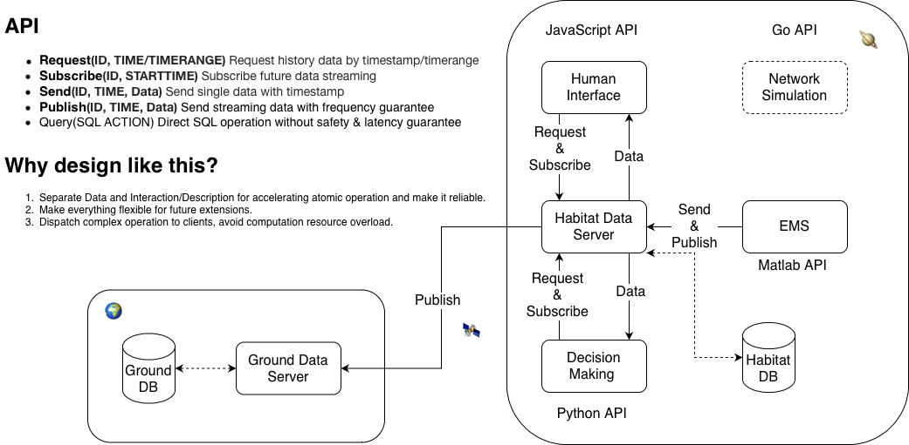
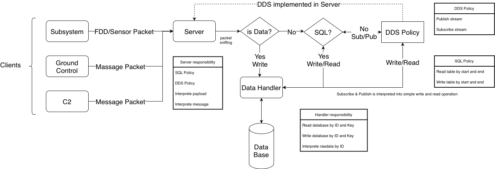
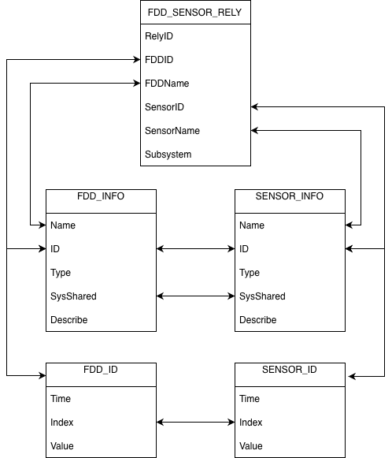
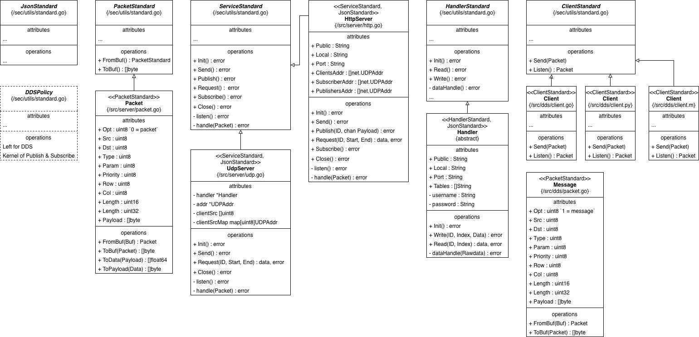
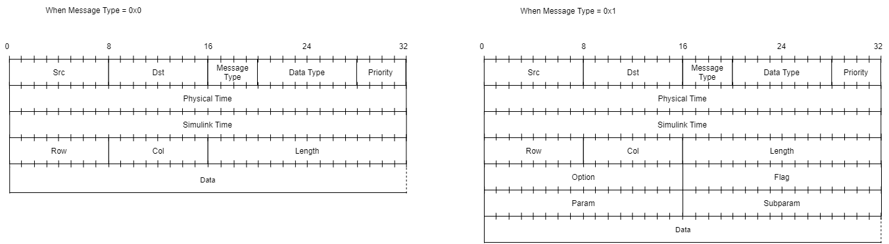

# Data Distribution Service for NASA RETHi Project

## 1. Project motivation 

This repository contains the source code of Data Service System of NASA-RETHi project. The whole RETHi project aims to develop the Resilient Extra-Terrestrial Habitats for future Moon/Mars expedition, which is divided into three related research thrusts:

1. **System Resilience** develop the techniques needed to establish a control-theoretic paradigm for resilience, and the computational capabilities needed to capture complex behaviors and perform trade studies to weigh different choices regarding habitat architecture and onboard decisions.
2. **Situational Awareness** develop and validate generic, robust, and scalable methods for detection and diagnosis of anticipated and unanticipated faults that incorporates an automated active learning framework with robots- and humans-in-the-loop.
3. **Robotic Maintenance** develop and demonstrate the technologies needed to realize teams of independent autonomous robots, incorporating the use of soft materials, that navigate through dynamic environments, use a variety of modular sensors and end-effectors for specific needs, and perform tasks such as collaboratively replacing damaged structural elements using deployable modular hardware.

Please visit https://www.purdue.edu/rethi for more information.

## 2. Current design

### 2.1 DDS - Data flow

### 2.2 DDS - Data flow in Server

### 2.3 DDS - Database schema

### 2.4 DDS - System design

## 3. Service Protocol
- **For Python, please reference [demo.py](./demo.py) and [api.py](./api.py).**
- **For GoLang, please reference demo.go and api.go.**
- **For JavaScript, please reference demo.html**
- **Simulink API is still being developed**
- **For other Language, please implement by following standards:**

### 3.1 Packet

Data packet is the basic form to send data and also to implement service API:

- Src: Source address
- Dst: Destination address
- MessageType(messaage_type): Types of packet
  - 0x00: Packet defined by Communication network
  - 0x01: Packet defined Data Service
- DataType(data_type): Types of data from 0 to 255
  - 0x00: No data
  - 0x01: FDD data
  - 0x02: Sensor data
  - 0x03: Agent data
  - 0x03: Other data
- Priority(priority): Priority of frame
- Opt(opt): Options from 0 to 65535
  - 0x0001: Send operation
  - 0x0002: Request operation
  - 0x0003: Publish operation
  - 0x0004: Subscribe operation
  - 0x000A: Response
- Flag(flag):
  - 0x0000: Single message
  - 0x0001: Streaming message
  - 0xFFFE: Warning
  - 0xFFFF: Error
- Time(time): Physical Unix time from 0 to 4294967295
- Row(raw): Length of data
- Col(col): Width of data
- Length(length): Flatten length of data (Row * Col)
- Param(param): Depends on Opt
- SubParam(subparam): Depends on Opt
- Data(data): Data in bytes

*Name in bracket is for JSON structure.*

### 3.2 Send

Before use the API, please make sure:

- Understand IP and Port of server 
- Understand IP, Port and ID of client: ID should be unique from 0 to 255, ID 0 is saved for habitat db, ID 1 is saved for ground db.
- Client information must be registered in server configuration files.

To send asynchronous data, first set up headers:

- Src = ID of client
- Des = 0
- Message_Type = 1
- Data_Type = Depends on data
- Priority_Type = 7
- Physical_Time = Message sending time
- Simulink_Time = Simulink time of data
- [Row, Col, Length] depend on the data
- Opt = 0
- Flag = 0
- Param = ID of data will be sent
- Subparam = 0
- Data = One row of sending data in C_Double

Finally send this packet by UDP channel to server.

*⚠️ Note - Send data can be lost, and no response from server.*

### 3.3 Request

To require asynchronous data, first set up headers:

- Src = ID of client
- Des = 0
- Message_Type = 1
- Data_Type = 0
- Priority_Type = 7
- Physical_Time = Message sending time
- Simulink_Time = Simulink time of data
- [Row, Col, Length]  = [0, 0, 0]
- Opt = 1
- Flag = 0
- Param = ID of data requested
- Subparam = Number of rows of required data
- Data = Empty

Then send this packet by UDP channel to server.

Next keep listening from server, a packet will be send back with following headers:

- Src = 0
- Des = ID of Client
- Message_Type = 1
- Data_Type = Depend on data
- Priority_Type = 7
- Physical_Time = Message sending time
- Simulink_Time = Simulink time of data
- [Row, Col, Length]  = Depend on data
- Opt = 1
- Flag = 0
- Param = ID of data requested
- Subparam = Number of rows of required data
- Data = Requested data

Finally decode payload by its shape [Row * Col]

*⚠️ Note - Both request operation and response data can be lost*

### 3.4 Publish

To publish data synchronously, set up headers for registering publish first:

- Src = ID of client
- Des = 0
- Message_Type = 1
- Data_Type = 0
- Priority_Type = 7
- Physical_Time = Message sending time
- Simulink_Time = Start Simulink time of Publishing
- [Row, Col, Length]  = [0, 0, 0]
- Opt = 2
- Flag = 0
- Param = ID of data published
- Subparam = 0
- Data = Empty

Then send this packet by UDP channel to server.

Keep listening from server, a packet will be send back with following headers:

- Src = 0
- Des = ID of client
- Message_Type = 1
- Data_Type = Depend on data
- Priority_Type = 7
- Physical_Time = Message sending time
- Simulink_Time = Start Simulink time of Publishing
- [Row, Col, Length]  = [0, 0, 0]
- Opt = 2
- Flag = 0
- Param = ID of data published
- Subparam = Rate of data published
- Data = Empty

When receive the above packet, start continuously pushing streaming to server with following headers setting. Decide the shape[Row and Col] of data based on the estimated latency of network and data frequency:

- Src = ID of client
- Des = 0
- Message_Type = 1
- Data_Type = Depend on data
- Priority_Type = 7
- Physical_Time = Message sending time
- Simulink_Time = Start Simulink time of Publishing
- [Row, Col, Length]  = Depend on data
- Opt = 2
- Flag = 1
- Param = ID of data published
- Subparam = 0
- Payload = Data publishing to server

To terminate publishing, send

- Src = ID of client
- Des = 0
- Message_Type = 1
- Data_Type = 0
- Priority_Type = 7
- Physical_Time = Message sending time
- Simulink_Time = Start Simulink time of 
- [Row, Col, Length]  = [0, 0, 0]
- Opt = 2
- Flag = 0
- Param = ID of data published
- Subparam = 0
- Data = Empty

\[ Same as register\]

~~Once server finds data missing or latency it will send warning or error packet back.~~

### 3.5 Subscribe

To subscribe data synchronously, set up headers for registering subscribe first:

- Src = ID of client
- Des = 0
- Message_Type = 1
- Data_Type = 0
- Priority_Type = 7
- Physical_Time = Message sending time
- Simulink_Time = Start Simulink time of Subscribe
- [Row, Col, Length]  = [0, 0, 0]
- Opt = 3
- Flag = 0
- Param = ID of data subscribed
- Subparam = Rate of data subscribed
- Data = Empty

Then keep listening from server, a stream will be continuously send back with following headers:

- Src = 0
- Des = ID of client
- Message_Type = 1
- Data_Type = Depend on data
- Priority_Type = 7
- Physical_Time = Message sending time
- Simulink_Time = Start Simulink time of Subscribe
- [Row, Col, Length] = Depend on data
- Opt = 3
- Flag = 1
- Param = ID of data subscribed
- Subparam = 0
- Data = Data subscribing from server

~~Once client finds data missing it need to send a subscribe from the missing data again.~~

To terminate Subscribe function, send

- Src = ID of client
- Des = 0
- Message_Type = 1
- Data_Type = 0
- Priority_Type = 7
- Physical_Time = Message sending time
- Simulink_Time = Start Simulink time of Subscribe
- [Row, Col, Length]  = [0, 0, 0]
- Opt = 3
- Flag = 0
- Param = ID of data subscribed
- Subparam = 0
- Data = Empty
 
\[ Same as register\]

## 4. Current Plan

This is the current [plan](https://docs.google.com/document/d/1x7Yfs2CWdzcWZeG3DvCrZ7T6m8J3jXQr/edit) for Communication and Data Repository subgroup.

This is the current [plan](https://docs.google.com/document/d/1GJCyouMTSlMumpTqZ8Hr3953wPf2M3Aw3xg-r41WJaQ/edit#heading=h.ppyfpgqg4oc5) for the DMG group.

1. Fill in the info table and link table with Ryan.
2. Change the code of MCVT simulink and send to server.
3. Can integrate MVCT simulink and server.

 *This project is supported by the National Aeronautics and Space Administration*

