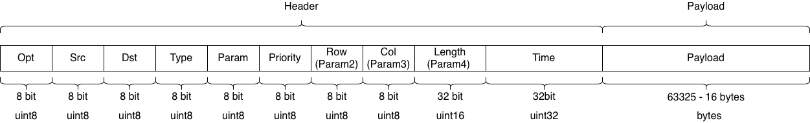

# Data Distribution Service for NASA RETHi Project

This repository contains the source code of Data Repository System of NASA-RETHi project. The whole RETHi project aims to develop the Resilient Extra-Terrestrial Habitats for future Moon/Mars expedition, which is divided into three related research thrusts:

1. **System Resilience** develop the techniques needed to establish a control-theoretic paradigm for resilience, and the computational capabilities needed to capture complex behaviors and perform trade studies to weigh different choices regarding habitat architecture and onboard decisions.
2. **Situational Awareness** develop and validate generic, robust, and scalable methods for detection and diagnosis of anticipated and unanticipated faults that incorporates an automated active learning framework with robots- and humans-in-the-loop.
3. **Robotic Maintenance** develop and demonstrate the technologies needed to realize teams of independent autonomous robots, incorporating the use of soft materials, that navigate through dynamic environments, use a variety of modular sensors and end-effectors for specific needs, and perform tasks such as collaboratively replacing damaged structural elements using deployable modular hardware.

Please visit https://www.purdue.edu/rethi for more information.

## 1. Project motivation 

Data distribution service is an important component in the extra-terrestrial habitat system and plays a key role in sensor monitoring, data remaining, communication, and decision making.  

The primary concern of any outer space activity is ensuring safety, which usually involves tons of sensor data from several different subsystems, i.e. power system, interior environment system, and intervention agents to monitoring and controlling. How to ensure the real-time guarantee and 

## 2. Current design

### 2.1 DDS - Data flow

### 2.2 DDS - Data flow in Server

### 2.3 DDS - Database schema

### 2.4 DDS - System design

## 3. Service API
- For Python, please reference [demo.py](./demo.py) and [api.py](./api.py).
- For GoLang, please reference demo.go and api.go.

### 3.1 Packet

Data packet is the basic form to send data and also to implement service API:

- Opt: Operation type in {0, 1, 2, 3, 4, 5} 
  - 0: Send operation
  - 1: Request operation
  - 2: Publish operation
  - 3: Subscribe operation
  - 4: Warning
  - 5: Error
- Src: Source of packet, associated with Subsystem ID
- Des: Destination of packet, associated with Subsystem ID
- Type: Types of data in {0, 1, 2, 3}
  - 0: No data in payload
  - 1: FDD data
  - 2: Agent data
  - 3: Sensor data
- Param: Parameter for operation, representing Data ID now
- Priority: Priority
- Row / Param2: Length of data in payload
- Col / Param3: Width of data in payload
- Length: Length of payload (When Length = 0, Row and Col can be extral parameter)
- Time: Synchronous time of each data/operation
- Payload: Data in bytes, float64 for representing real data

### 3.2 Send

Before use the API, please make sure:

- Understand IP and Port of server 
- Understand IP, Port and ID of client: ID should unique in [1, 65536), ID 0 is left for server
- Client information must be registered in server configuration files.

To send asychronous data, first set up headers:

- Opt = 0
- Src = ID of client
- Des = 0
- Param = ID of data will be sent
- Time = Synchronous time of data generated
- Priority = Priority
- [Type, Row, Col, Length] are depended on the data

Then set payload as the bytes array of the data, each element of data for 8 bits.

Finally send this packet by UDP channel to server.

*⚠️ Note - Send data can be lost, and no response from server.*

### 3.3 Request

To require asychronous data, first set up headers:

- Opt = 1
- Src = ID of client
- Dst = 0
- Param = ID of data will be retrieved
- Time = Synchronous time of data generated
- Priority = Priority
- Row = 1 for requesting by timestamp / Row > 1 for requesting by time range, where TimeStart = Time, TimeEnd = Time + Length
- Length = 0
- Type = 0
- [Col, Payload] have no influence on Request operation, can left for future extension.

Then send this packet by UDP channel to server.

Next keep listening from server, a packet will be send back with following headers:

- Opt = 1
- Src = 0
- Dst = ID of client
- Param = ID of data is being retrieved
- Time = Synchronous time of data generated
- Priority = Priority
- Row = Length of data in payload
- Col = Width of data in payload
- Length = Row * Col
- Payload = The data you requested

Finally decode payload by its shape [Row * Col]

*⚠️ Note - Both request operation and response data can be lost*

### 3.4 Publish

To publish data synchronously, set up headers for registering publish first:

- Opt = 2
- Src = ID of client
- Dst = 0
- Param = ID of data being published
- Priority = Priority
- Length = 0
- Payload = No data for publish request

Then send this packet by UDP channel to server.

Keep listening from server, a packet will be send back with following headers:

- Opt = 2
- Src = 0
- Dst = ID of client
- Param = ID of data being published
- Priority = Priority
- Row = Rate of data published
- Length = 0
- Payload = No data for publish request

When receive the above packet, start continuously pushing streaming to server with following headers setting. Decide the shape[Row and Col] of data based on the estimated latency of network and data frequency:

- Opt = 2
- Src = ID. of client
- Dst = 0
- Param = ID of data being published
- Priority = Priority
- Time = Synchronous time
- Payload = Data published to server
- [Type, Row, Col, Length] are depended on the data

~~Once server finds data missing or latency it will send warning or error packet back.~~

### 3.5 Subscribe

To subscribe data synchronously, set up headers for registering subscribe first:

- Opt = 3
- Src = ID of client
- Dst = 0
- Param = ID of data being subscribe
- Priority = Priority
- Time = Time start for subscription
- Length = 0
- Payload = No data for subscribe request

Then keep listening from server, a stream will be continuously send back with following headers:

- Opt = 3
- Src = ID of client
- Dst = 0
- Param = ID of data being subscribe
- Priority = Priority
- Time = Synchronous time of data generated
- Payload = Subscribed data
- [Type, Row, Col, Length] are depended on the data

~~Once client finds data missing it need to send a subscribe from the missing data again.~~

 

## 4. Current Plan

This is the current [plan](https://docs.google.com/document/d/1GJCyouMTSlMumpTqZ8Hr3953wPf2M3Aw3xg-r41WJaQ/edit#heading=h.ppyfpgqg4oc5) for the DMG group.

 *This project is supported by the National Aeronautics and Space Administration*

